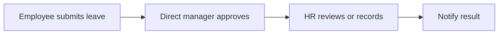

# Clarify Round 1

## Question 1

**Context**  
What you have made clear so far is "build an internal company leave request system", but not yet how big the first version should be. This directly affects the number of screens, table design, the permission model, and the development timeline. MVP here means the minimal viable scope for the first version — getting the most core, must-not-fail flow right first, rather than stuffing all HR features in from the start.

**Summary Question**  
Which scope do you want delivered first in the first version?

**Options (single choice)**

| No. | Option | Description |
| --- | --- | --- |
| 1 | Leave applications and manager approval only (Recommended: lock down the core flow first, verify requirements fastest) | First support employees submitting leave, managers approving or rejecting, and querying application records; no scheduling, punch-card fixes, or reports yet. |
| 2 | Leave application + manager approval + HR management back office | Besides the employee and manager flows, let HR view company-wide leave status, adjust leave types, and manage rules. |
| 3 | Build the full attendance management system directly | Besides leave, also include punch-card fixes, overtime, scheduling, reports, and leave quota management; the largest scope but also the slowest. |
| 4 | Others | My need is none of the above three; I want to add the scope the first version really should cover. |

## Question 2

**Context**  
The approval flow directly changes the system flow, notification nodes, and data structures. If you only need single-level approval, the system can be very simple; if you need dual-level or conditional approval, more rule-configuration capability must be reserved later.

The diagram above is only an illustrative flow; the point is to confirm how many approval levels you want, not to decide the screens' appearance first.

**Summary Question**  
Which approval mode do you want to adopt for the leave flow in the first version?

**Options (single choice)**

| No. | Option | Description |
| --- | --- | --- |
| 1 | Single-level approval (Recommended: the most stable flow, best suited for the first version) | After the employee submits, only the direct manager approves or rejects. |
| 2 | Dual-level approval | After the employee submits, it goes through the manager first, then HR or a second-level manager confirms. |
| 3 | Condition-based approval rule switching | For example, a second level is required only when leave days exceed a threshold; the most flexible but the most complex rule design. |
| 4 | Others | My approval flow is none of the above modes; I want to add the actual flow. |

## Question 3

**Context**  
The notification approach affects the system boundary. If the first version already integrates Slack, Email, or Google Calendar, the development scope expands; if only in-app notifications first, the system is more closed but delivery is faster. This question is not asking about "the ideal final version" but "what the first version must have".

**Summary Question**  
What level of notification and integration do you most want achieved in the first version?

**Options (single choice)**

| No. | Option | Description |
| --- | --- | --- |
| 1 | In-app notifications only first (Recommended: get the product core running smoothly first, then decide which external services to connect) | Application submission, approval results, etc. are only displayed in the system; no external tools yet. |
| 2 | In-app notifications + Email | Besides in-system display, also send Email; suitable when company members rarely log into the system. |
| 3 | In-app notifications + collaboration tool integration | For example Slack, Teams, or Google Calendar; a complete experience but higher integration cost. |
| 4 | Others | I already have a specified notification or integration approach; I want to add it directly. |

Please reply directly with option numbers by question number; if your situation is not among the existing options, choose `Others` and add an explanation.
